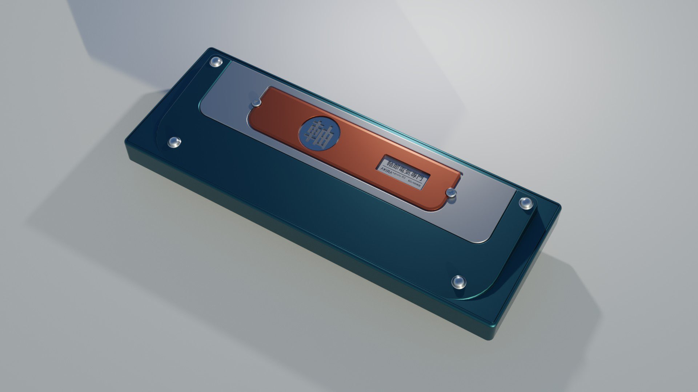
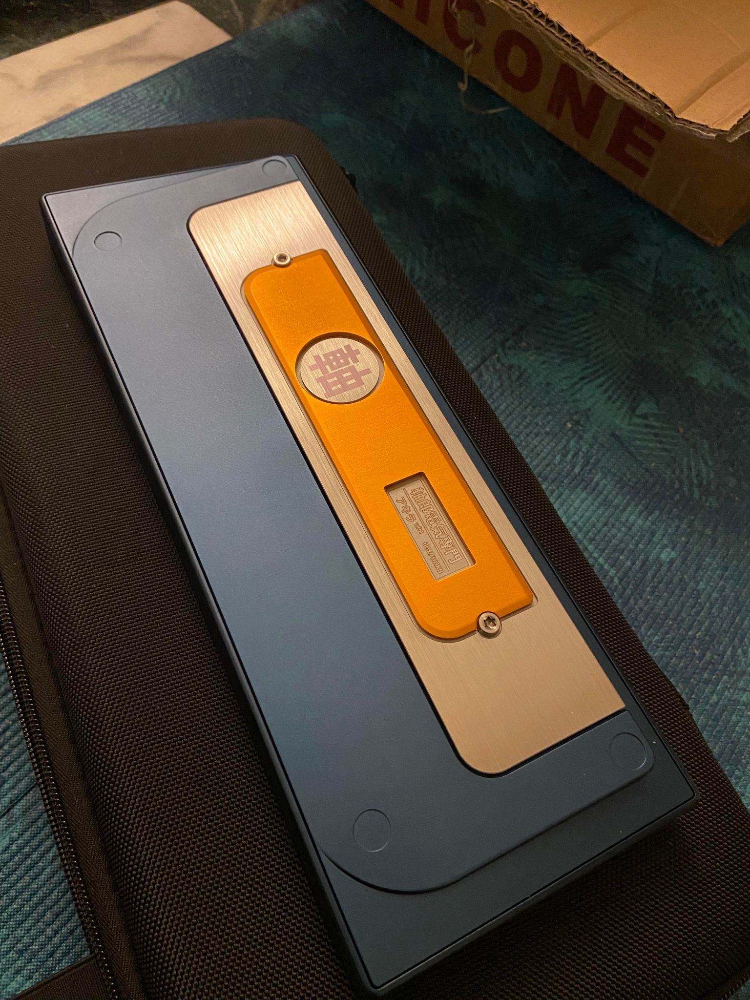
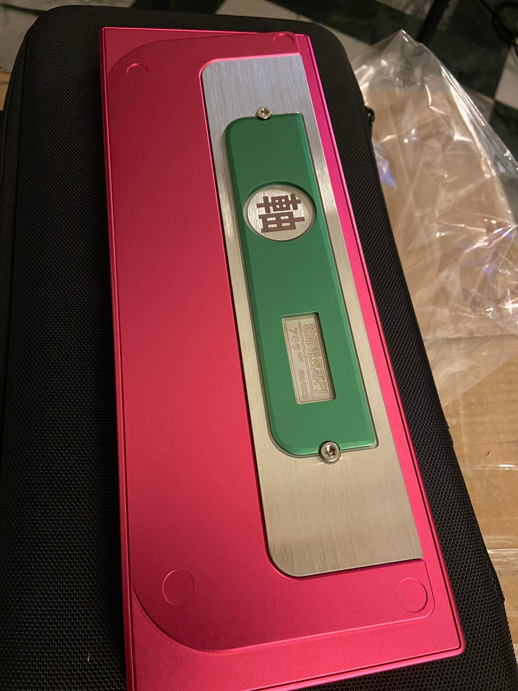

# **GroupBuy資格與規定**

本次登記出售版本: **AKIRA-V3**

<figure markdown>
  { width="600" }
<figcaption>售價: 12,000 NTD</figcaption>

  <figcaption>AKIRA-V3</figcaption>
</figure>

## 購買資格
### **售價: 12,000 NTD**
- 於意願登記開放時間內登記[表單](https://forms.gle/oMEKPyU3JQcP6i129)者，目前開放17套(數量表示如下)
- 開放時間 **2023/3/4 ~ 2023/4/3**，開放一個月，視登記情況而定可能提早截止。

!!warning 

    購買前請過目QC標準[Quality Control Rule](https://docs.google.com/document/d/153XZmJMXxQzAGgvxCWZMYalS6vw_5wv_01x4JV6Pi6Q/edit)

## 出貨方式: 全款後7-11賣貨便
- 於意願登記結束後，**3日內會以email通知，未抽中資格者不會另外再做通知**，如未在時段內**一週內**回信視為放棄資格。
- 貨物皆以7-11賣貨便出貨，請於3日內完成付款，隨後出貨。

## ** 參考打字音 **

<iframe width="560" height="315" src="https://www.youtube.com/embed/HL2KWSxJry0" title="YouTube video player" frameborder="0" allow="accelerometer; autoplay; clipboard-write; encrypted-media; gyroscope; picture-in-picture; web-share" allowfullscreen></iframe>

#### 顏色:
    1. 藍色 + 橘色背板   (9套)
    2. 洋紅色 + 綠色背板 (8套) 

<figure markdown>
  { width="600" }
  <figcaption>藍色+橘色背板</figcaption>
</figure>

<figure markdown>
  { width="600" }
  <figcaption>洋紅色+綠色背板</figcaption>
</figure>

!!! note

    實物會有些許色差

### AKIRA-KIT 內容物:

    外殼(上下蓋):
        材質: 
            - 6063 鋁合金
        表面處理:
            - 180 玻璃噴沙
            - 陽極

    定位版*2:
        - 鋁定(黑色)
        - PC定(黑色)

    配重: 
        材質:
            - 304不鏽鋼
        表面處理: 
            - 150 玻璃噴砂
            - **底部髮絲紋**

    配件包
        - AKIRA Keyboard Carrying Case * 1
        - AKIRA-HHKB: PCB 套件
           - Hotswap Socket 
           - JST-Cable
           - M2.5 Spacer * 8
           - M2.5 Spacer top screws * 8
           - M2.5 Spacer lower screws * 8 

        - AKIRA:Poron套件
           - PCB Foam  * 1
           - PCB PE Foam * 1

        - AKIRA:Gasket 套件
           - Hard Gasket lower * 1
           - Soft Gasket lower * 1
           - Gasket Top * 1
           - 腳墊 * 1套
        
        - 螺絲起子梅花頭
            - M2.5 * 1
            - M20  * 1

!!! note

    耗材(Gasket, Poron)會在GB結束後，提供額外購買。

# 表單

<iframe src="https://docs.google.com/forms/d/e/1FAIpQLSdaqFLFSvkyfeAdS2ODij8t3PL9UU7tSPonw7w973NFCw6x-A/viewform?embedded=true" width="640" height="3239" frameborder="0" marginheight="0" marginwidth="0">載入中…</iframe>

!
