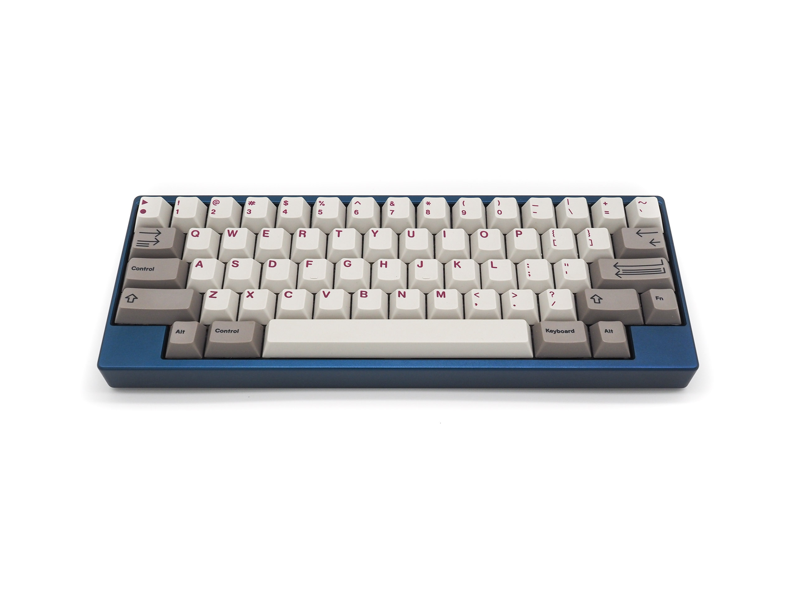
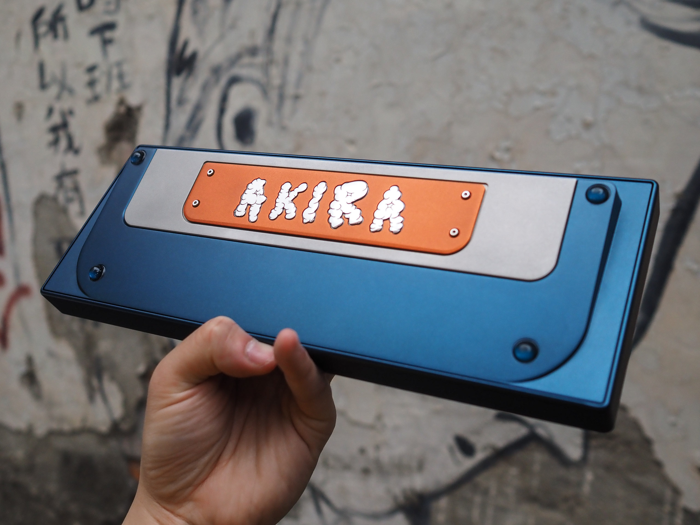
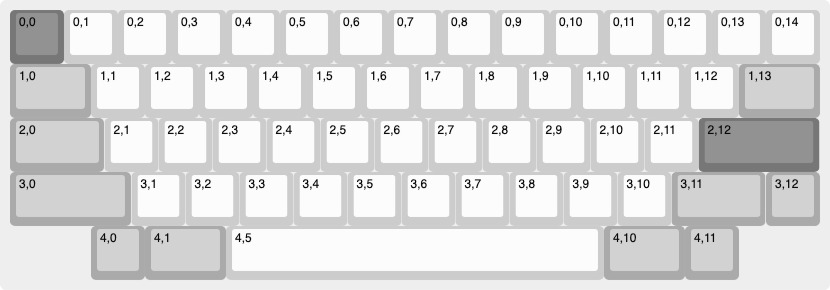
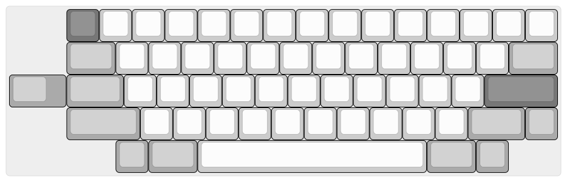

# **AKIRA: HHKB**

<figure markdown>
  { width="600" }
  { width="600" }
</figure>

## Design
AKIRA主要是一把全部由我個人獨自開發以及設計的一把鍵盤，自2020年入坑鍵盤後，在面對網路上看的到，但買不到的鍵盤，真是又愛又恨，在這種情緒下，AKIRA就誕生了，名字取自大友克洋的作品AKIRA，故事內容講述一個平凡的暴走族少年得到非比尋常力量後的故事也是Cyber Punk風格的代表作品之一，也許在這裏你會期待鍵盤命名與AKIRA的內容有何關係？其實也不需要什麼關係，就跟當初設計AKIRA的衝動一樣，就是反應生命中的情緒，但也許也有關係，而你能從中發現其中的關聯，那你一定是在紅色藥丸中找到了程式碼的奧秘如果你發現這行字且想要購買的話直接tn00372136@gmail.com我有幫你留一把，希望大家喜歡這把鍵盤。

<figure markdown>
  { width="600" }
  <figcaption>AKIRA-V2</figcaption>
</figure>

--- 
# Layout

<figure markdown>
  { width="600" }
  <figcaption>keymap-matrix</figcaption>
</figure>

<figure markdown>
  { width="600" }
  <figcaption>Layout</figcaption>
</figure>

## Features
1. **Multi-level Gasket Mount**
2. **PCB Flex Cut Design**

---
## 購買資訊
請參照<a href="gb_rule">GroupBuyRule</a>

## Issues
如果PCB/firmware有問題請在github 發issue, firmware更新 也會在上面更新。

* [AKIRA github issiue](https://github.com/EugenePY/AKIRA-GB/issues)

* [AKIRA firmware Release](https://github.com/EugenePY/AKIRA-GB/issues)

## Firmware & PCB
請參照pcb specs頁面。
-- 

## 特別感謝
**感謝Liubrecated照片支援, 及timmylin的幫助.**
