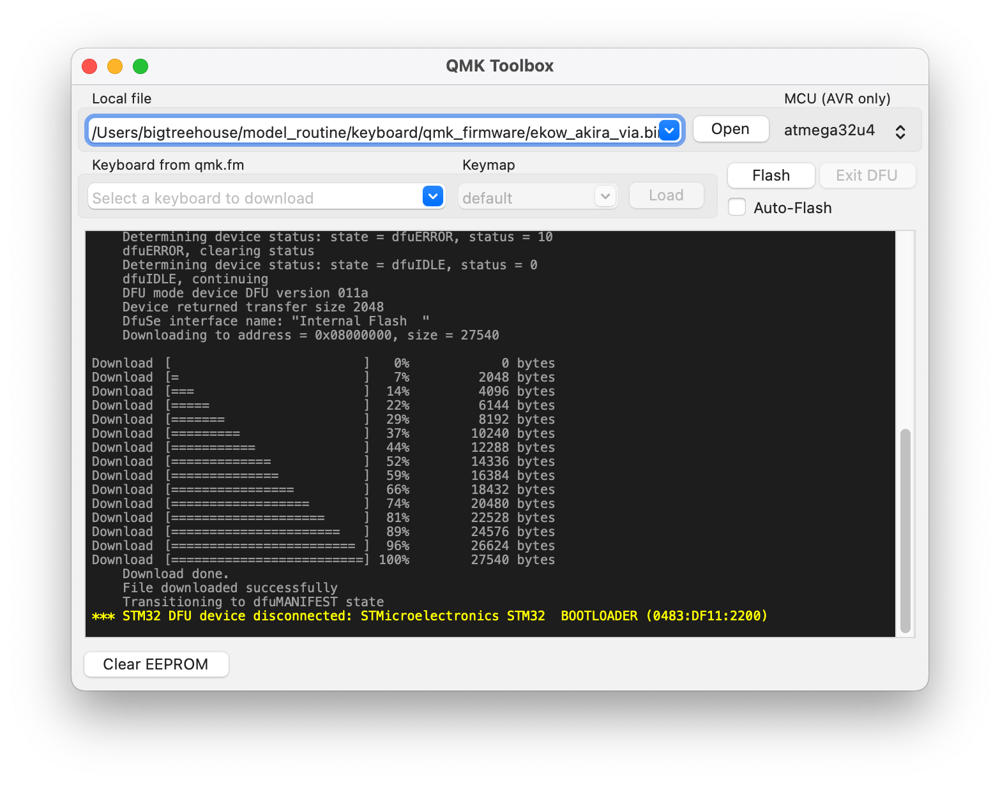

# AKIRA PCB Designs.

<figure markdown>
  
  <figcaption>AKIRA-V2</figcaption>
</figure>


## 如何更新AKIRA PCB Firmware
更新AKIRA firware 的方法有幾種，最直接的是 **方法1** 利用QMK Toolbox來下載韌體，
其餘的方法需要command line的操作。

##方法1
透過using QMK toolbox

1. 取得最新版本得[AKIRA QMK firmware](https://github.com/EugenePY/AKIRA-GB/releases/)

2. 安裝[QMK Toolbox](https://github.com/qmk/qmk_toolbox)

<figure markdown>
  
  <figcaption>將下載下來的韌體用QMK Toolbox打開</figcaption>
</figure>

</figure>

3. 將AKIRA進入dfu-mode(長按reset buttom)


<figure markdown>
  
  <figcaption>長按Reset(pcb板背面左下角sw1)</figcaption>
</figure>


<figure markdown>
  
  <figcaption>按下Flash</figcaption>
</figure>


### 進階Flashing Firmware

本方法是採用自行編譯後用qmk-cli下載firmware

1. 安裝dfu-util(基本上有安裝QMK toolbox 就會有dfu-util, 如果有安裝可以跳過) 
安裝過程請參考[dfu-util installation guide](https://docs.particle.io/archives/installing-dfu-util/)

2. 長按AKIRA-PCB上的reset 按鈕進入dfu-mode.

在command line/shell

```shell
dfu-util -l
```
如果成功會看到command line輸出。

```shell
dfu-util 0.11

Copyright 2005-2009 Weston Schmidt, Harald Welte and OpenMoko Inc.
Copyright 2010-2021 Tormod Volden and Stefan Schmidt
This program is Free Software and has ABSOLUTELY NO WARRANTY
Please report bugs to http://sourceforge.net/p/dfu-util/tickets/

Found DFU: [0483:df11] ver=2200, devnum=19, cfg=1, intf=0, path="20-1", alt=1, name="@Option Bytes  /0x1FFFF800/01*016 e", serial="FFFFFFFEFFFF"
Found DFU: [0483:df11] ver=2200, devnum=19, cfg=1, intf=0, path="20-1", alt=0, name="@Internal Flash  /0x08000000/032*0001Kg", serial="FFFFFFFEFFFF"
```

3. 下載qmk source.

```shell
git clone https://github.com/EugenePY/qmk_firmware
git submodule update --recursive
git checkout akira-master
```

再次確認AKIRA進入dfu-mode後執行
```
qmk --verbose flash -kb ekow/akira -km via
```

## Appendix

## AKIRA: PCB SWD(Serial Debug Port)

AKIRA PCB上面有提供SWD 其中接口使用tag connector [TC2030-IDC](https://www.digikey.tw/zh/products/detail/tag-connect-llc/TC2030-IDC/4571121?utm_adgroup=General&utm_source=google&utm_medium=cpc&utm_campaign=PMax%20Shopping_Product_Zombie%20SKUs&utm_term=&productid=4571121&gclid=CjwKCAiAr4GgBhBFEiwAgwORrYy8zbG282oINpVlg11f_nZzoRh9QUr02wN_YFi7P6HA_MEquV4-AhoCm6EQAvD_BwE) layout.
一般使用者是不需用用到，除非使用者想要用AKIRA pcb開發自己的firmware，但一般不建議，如果有需求可以聯繫我我可以提供與AKIRA 相同晶片型號的開發板。

**使用方式**

<figure markdown>
  
  <figcaption> AKIRA SWD Interface</figcaption>
</figure>
1. 需要額外得的Debugger(JLink, STLink, DapLink...)
2. 將pcb插上usb過電, 後將Debugger的GND, sdio, sdclk接到對應在pcb上的pin的位置。


如有其他問題，請到[Discord](https://discord.gg/TjbJKxsu)私訊我。

## External References
[Flashing Guide from Cannonkeys](https://docs.cannonkeys.com/)
